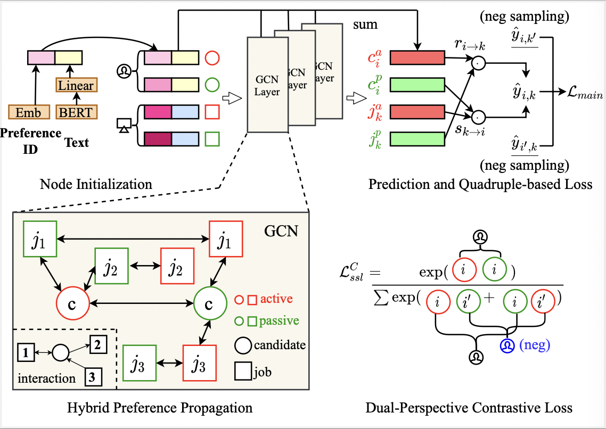

# DPGNN
This is the official PyTorch implementation for the paper:

> Modeling Two-Way Selection Preference for Person-Job Fit. RecSys 2022

## Overview

We propose a dual-perspective graph representation learning approach to model directed interactions between candidates and jobs for **person-job fit**, named Dual-Perspective Graph Neural Network (**DPGNN**).



## Requirements

```
torch==1.10.0+cu113
torch_geometric==2.0.2
cudatoolkit==11.3.1
```

## Dataset

`dataset_path` in `prop/overall.yaml` should contain the following files:

```
dataset_path/
├── data.{train/valid_g/valid_j/test_g/test_j/user_add/job_add}
├── {geek/job}.bert.npy
└── {geek/job}.token
```

### Train

```bash
python main.py
```

## Acknowledgement

The implementation is based on the open-source recommendation library [RecBole](https://github.com/RUCAIBox/RecBole) and [RecBole-PJF](https://github.com/RUCAIBox/RecBole-PJF).

Please consider citing the following papers as the references if you use our codes.

```
@inproceedings{yang2022modeling,
  author = {Chen Yang and Yupeng Hou and Yang Song and Tao Zhang and Ji-Rong Wen and Wayne Xin Zhao},
  title = {Modeling Two-Way Selection Preference for Person-Job Fit},
  booktitle = {{RecSys}},
  year = {2022}
}

@inproceedings{zhao2021recbole,
  title={Recbole: Towards a unified, comprehensive and efficient framework for recommendation algorithms},
  author={Wayne Xin Zhao and Shanlei Mu and Yupeng Hou and Zihan Lin and Kaiyuan Li and Yushuo Chen and Yujie Lu and Hui Wang and Changxin Tian and Xingyu Pan and Yingqian Min and Zhichao Feng and Xinyan Fan and Xu Chen and Pengfei Wang and Wendi Ji and Yaliang Li and Xiaoling Wang and Ji-Rong Wen},
  booktitle={{CIKM}},
  year={2021}
}

@article{zhao2022recbole,
  title={RecBole 2.0: Towards a More Up-to-Date Recommendation Library},
  author={Zhao, Wayne Xin and Hou, Yupeng and Pan, Xingyu and Yang, Chen and Zhang, Zeyu and Lin, Zihan and Zhang, Jingsen and Bian, Shuqing and Tang, Jiakai and Sun, Wenqi and others},
  journal={arXiv preprint arXiv:2206.07351},
  year={2022}
}
```

